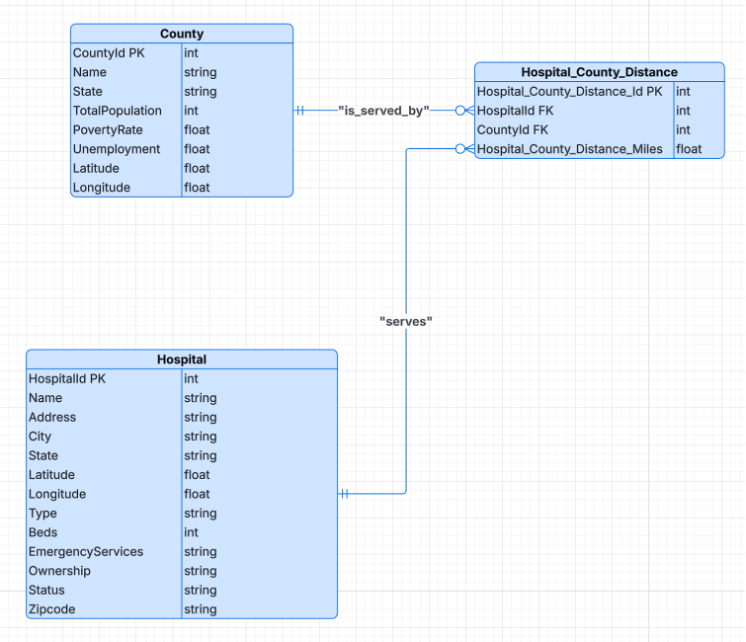

# Hospital Access Database — Rural Healthcare Analytics

Relational database analyzing rural healthcare access gaps across 
U.S. counties, motivated by real-world hospital closure data from 
the Texas Tribune.

## Research Question
Which is the nearest open hospital for each U.S. county, and which 
communities face the greatest healthcare access challenges due to 
hospital closures?

## Motivation
Inspired by: [Rural Texas counties lost most of their hospitals as 
more closed in 2024](https://www.texastribune.org/2025/04/23/texas-rural-trinity-hospital-closes/) 
— Texas Tribune, April 23, 2025

Rural hospital closures leave residents traveling 30+ miles for 
emergency care, disproportionately affecting low-income and 
uninsured populations.

## Dataset Sources
| Dataset | Source | Purpose |
|---|---|---|
| Hospitals in United States | [Kaggle](https://www.kaggle.com/datasets/thedevastator/hospitals-in-the-united-states-a-comprehensive-d) | Hospital locations and status |
| U.S. Census County Data | [Kaggle](https://www.kaggle.com/datasets/muonneutrino/us-census-demographic-data) | Population and socioeconomic context |
| U.S. County Centroids | [Kaggle](https://www.kaggle.com/datasets/canonicalized/county-centroids) | Geographic coordinates for distance calculation |

## Database Design

### Entities
- **Hospital** — HospitalId (PK), Name, Address, City, State, Latitude, Longitude, Type, Beds, EmergencyServices, Ownership, Status, Zipcode
- **County** — CountyId (PK), Name, State, TotalPopulation, PovertyRate, Unemployment, Latitude, Longitude
- **Hospital_County_Distance** — Hospital_County_Distance_Id (PK), HospitalId (FK), CountyId (FK), Hospital_County_Distance_Miles

### Normalization
- **3NF compliant** — eliminated all redundancy and update anomalies
- Hospital_County_Distance acts as central fact table
- Hospital and County act as dimension tables

## ERD


## Tools & Technologies
- MySQL
- MySQL Workbench
- ERD Design (Lucidchart)
- Query Optimization (EXPLAIN plans, SHOW PROFILE)

## Key SQL Query
Find nearest open hospital for each county:

```sql
SELECT hcd.CountyId, hcd.HospitalId, hcd.Hospital_County_Distance_Miles
FROM Hospital_County_Distance hcd
JOIN Hospital h ON hcd.HospitalId = h.HospitalId
JOIN (
  SELECT CountyId, MIN(Hospital_County_Distance_Miles) AS MinDistance
  FROM Hospital_County_Distance
  GROUP BY CountyId
) nearest
ON hcd.CountyId = nearest.CountyId
AND hcd.Hospital_County_Distance_Miles = nearest.MinDistance
WHERE h.Status = 'Open';
```

## Indexing & Performance Optimization

### Indexes Created
```sql
-- Filter open hospitals quickly
CREATE INDEX idx_status ON Hospital(Status);

-- Speed up JOIN operations
CREATE INDEX idx_hospital ON Hospital_County_Distance(HospitalId);

-- Optimize MIN() and GROUP BY operations
CREATE INDEX idx_county_distance ON 
Hospital_County_Distance(CountyId, Hospital_County_Distance_Miles);
```

### Performance Results
| Version | Execution Time | Improvement |
|---|---|---|
| Without indexes | 1.73 seconds | baseline |
| With indexes | 0.05 seconds | **32x faster** |

### EXPLAIN Plan Improvements
- Join type changed from `ALL` (full scan) to `eq_ref` and `range`
- Row scans dropped from 500,000+ to a few thousand
- `Using index for group-by` confirmed — temporary sorting eliminated

## Security Implementation
Role-based access control following Principle of Least Privilege:

```sql
-- Analyst: read only
CREATE USER 'analyst'@'localhost' IDENTIFIED BY 'AnalystPass123!';
GRANT SELECT ON hospital_access.* TO 'analyst'@'localhost';

-- Manager: read and update
CREATE USER 'manager'@'localhost' IDENTIFIED BY 'ManagerPass123!';
GRANT SELECT, UPDATE ON hospital_access.* TO 'manager'@'localhost';

-- Admin: full access
CREATE USER 'admin'@'localhost' IDENTIFIED BY 'AdminPass123!';
GRANT ALL PRIVILEGES ON hospital_access.* TO 'admin'@'localhost';
```

| Role | Permissions | Purpose |
|---|---|---|
| analyst | SELECT only | Read-only queries |
| manager | SELECT, UPDATE | Update hospital/county records |
| admin | ALL PRIVILEGES | Schema changes and setup |
| hackme | SELECT only | Security testing |

## Backup & Recovery Plan
- **Recovery Time Objective (RTO):** 4 hours
- **Strategy:** Full + Incremental Backup
  - Full backup: daily at midnight
  - Incremental backup: every 4 hours
- **Why:** Avoids re-running expensive distance calculations from scratch

## Key Findings
- Counties in rural Texas face 30+ mile travel distances to nearest open hospital
- Low-income northern counties show higher vulnerability due to combined distance and socioeconomic factors
- 3 strategic indexes reduced query time by **32x** (1.73s → 0.05s)
- Role-based security ensures data integrity with minimum privilege exposure

## Grade
**48/50**

## Files
| File | Description |
|---|---|
| `hospital_county_distance.sql` | Main SQL script |
| `access_details_hospital.sql` | Security and access control SQL |
| `county_data.csv` | County information dataset |
| `County_Centroids_data.csv` | County geographic coordinates |
| `Hospital_General_Information.csv` | Hospital details dataset |
| `hospital_locations.csv` | Hospital location data |
| `erd_diagram.png` | Entity Relationship Diagram |

## Lessons Learned
- Finding reliable and joinable datasets was the most challenging 
  part of the project — many datasets required significant cleaning 
  before use
- Designing the M:N relationship between Hospital and County 
  clarified the need for a bridge table (Hospital_County_Distance)
- Used Copilot to debug INSERT INTO...SELECT foreign key constraint 
  errors and to understand the difference between creating indexes 
  physically vs forcing index usage in queries
- Iterative design approach — revised ERD and queries multiple times 
  until they clearly addressed the real-world problem
